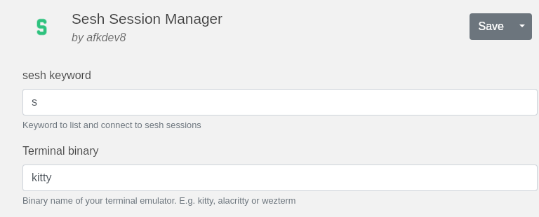
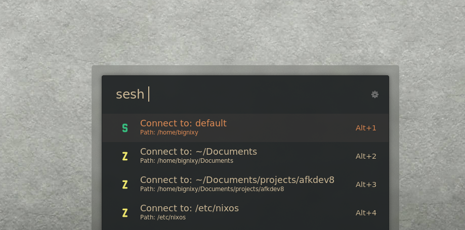

# SESHion-manager

This plugin is a fork of jacostag/sesh-ulauncher.
The original plugin did not do anything on my system. That is why I have adjusted the code and added some additional features.

## Requirements

- sesh
- zoxide
- sway

## Features

- Select tmux sessions
- Select zoxide directories
- Selected zoxide directories will open in new tmux session
- Selected tmux sessions will be focused if they are already open (in a window)
- If the session is not open SESHion-manager will it in a new terminal window

## Usage

- Define the keyword ("sesh" by default)
- Define the terminal binary ("kitty" by default)
- Run the plugin in ulauncher using the keyword ("sesh")
- Select a tmux session or zoxide directory
  
  

## Acknowledgement

This Plugin is a fork of sesh-ulauncher by jacostag - https://github.com/jacostag/sesh-ulauncher
